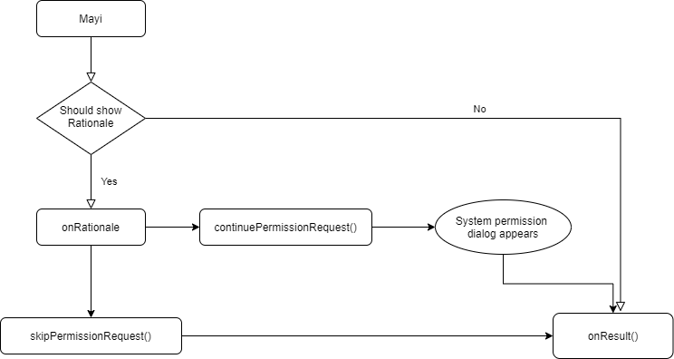

# MayI
MayI is yet another library that simplifies the process of requesting permissions at runtime for Harmony devices.
​
# Source
This library is inspired by the version 1.4 of the [MayI](https://github.com/ThanosFisherman/MayI-Java) library
​
## Features
*****Key Features added by this library
​
## Dependency
****How to add the dependency
​
## Usage
### Single Permission
To request a **single permission** using this library, you just need to call `Mayi` with a valid `AbilitySlice` and use `withPermission` method:

```java
public class MainAbilitySlice extends AbilitySlice
{
	@Override
    public void onStart(Intent intent)
    {
        super.onStart(intent);
	    Mayi.withActivity(MainAbilitySlice.this)
            .withPermission(SystemPermission.MICROPHONE)
            .onResult(permission -> permissionResultSingle(permission))
            .onRationale((permission, token) -> permissionRationaleSingle(permission,token))
            .check()
	}
}
```

`permissionResultSingle` and `permissionRationaleSingle` could be custom-defined methods of your own that would deal accordingly in each situation. For Example:

```java
private void permissionResultSingle(PermissionBean permission)
{
	new ToastDialog(getContext()).setText("PERMISSION RESULT " + permission.toString()).show();
}
 
private void permissionRationaleSingle(PermissionBean bean, PermissionToken token)
{
	new ToastDialog(getContext()).setText("Should show rationale for " + bean.getSimpleName() + " permission").show();
    token.skipPermissionRequest();   
}
```
### Multiple Permissions
Similarly to request **multiple permissions** at once, you just need to call `Mayi` with a valid `Activity` but this time use `withPermissions` method to specify more than one permissions. Furthermore
the lambda expressions from the example above could be replaced with method references like so:

```java
public class MainAbilitySlice extends AbilitySlice
{
	@Override
    public void onStart(Intent intent)
    {
        super.onStart(intent);
	    Mayi.withActivity(this)
            .withPermission(SystemPermission.MICROPHONE, SystemPermission.LOCATION)
            .onRationale(this::permissionRationaleMulti)
            .onResult(this::permissionResultMulti)
            .check()
	}
}
```

Again possible custom-defined methods for the above example could be something like:

```java
private void permissionResultMulti(PermissionBean[] permissions)
{
	new ToastDialog(getContext()).setText("MULTI PERMISSION RESULT " + Arrays.deepToString(permissions)).show();

private void permissionRationaleMulti(PermissionBean[] permissions, PermissionToken token)
{
	new ToastDialog(getContext()).setText("Rationales for Multiple Permissions " + Arrays.deepToString(permissions)).show();
    token.continuePermissionRequest();
}
```

### Error handling
If you think there is going to be an error in your Mayi integration, just call a `onErrorListener`:

```java
    Mayi.withActivity(this)
    .withPermissions(SystemPermission.MICROPHONE, SystemPermission.LOCATION)
    .onRationale(this::permissionRationaleMulti)
    .onResult(this::permissionResultMulti)
    .onErrorListener(this::inCaseOfError)
    .check());
    
private void inCaseOfError(Exception e)
{
	new ToastDialog(getContext()).setText("ERROR " + e.toString()).show();
}
```

The library will then notify you when something unexpected happens.

## Library Flow
* The first time this library runs, a new slice appears and `onRationale()` is called.
Inside `onRationale` method you now have 3 options. 
    * Call `token.continuePermissionRequest()` method which shows again system dialog prompt and then calls `onResult()` that includes the user's choice.
    * Call `token.skipPermissionRequest()` method which will skip showing system dialog prompt and immediately call `onResult()` that includes the user's choice.
    * Call none of the 2 above thus terminating the flow after `onRationale` finishes its execution.
* If user denied the permission by checking _"don't ask again"_ then `onResult()` will be called that includes the result of the user's choice. You may check whether the permission has been permanently denied via the `PermissionBean#isPermanentlyDenied()` method which is included in the `onResult()`.

below is a flow chart that visualizes the library's flow described above.




​
## Future work
In our version, the flow directly goes to the onRationale() for the first time, while it should ask the user permission through a system dialog prompt. This is due to the absence of a method analogous to `shouldShowRequestPermissionRationale` in HMOS. If we have support of this method, we can implement this 
